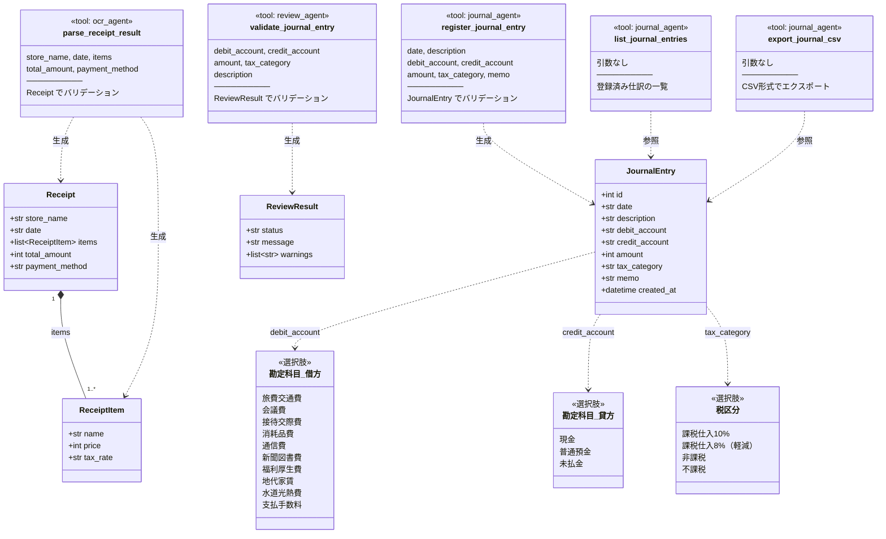

```mermaid
classDiagram
    direction TB

    class Receipt {
        +str store_name
        +str date
        +list~ReceiptItem~ items
        +int total_amount
        +str payment_method
    }

    class ReceiptItem {
        +str name
        +int price
        +str tax_rate
    }

    class JournalEntry {
        +int id
        +str date
        +str description
        +str debit_account
        +str credit_account
        +int amount
        +str tax_category
        +str memo
        +datetime created_at
    }

    class ReviewResult {
        +str status
        +str message
        +list~str~ warnings
    }

    class parse_receipt_result {
        <<tool: ocr_agent>>
        store_name, date, items
        total_amount, payment_method
        ──────────
        Receipt でバリデーション
    }

    class register_journal_entry {
        <<tool: journal_agent>>
        date, description
        debit_account, credit_account
        amount, tax_category, memo
        ──────────
        JournalEntry でバリデーション
    }

    class list_journal_entries {
        <<tool: journal_agent>>
        引数なし
        ──────────
        登録済み仕訳の一覧
    }

    class export_journal_csv {
        <<tool: journal_agent>>
        引数なし
        ──────────
        CSV形式でエクスポート
    }

    class validate_journal_entry {
        <<tool: review_agent>>
        debit_account, credit_account
        amount, tax_category
        description
        ──────────
        ReviewResult でバリデーション
    }

    Receipt "1" *-- "1..*" ReceiptItem : items

    parse_receipt_result ..> Receipt : 生成
    parse_receipt_result ..> ReceiptItem : 生成
    register_journal_entry ..> JournalEntry : 生成
    list_journal_entries ..> JournalEntry : 参照
    export_journal_csv ..> JournalEntry : 参照
    validate_journal_entry ..> ReviewResult : 生成

    class 勘定科目_借方 {
        <<選択肢>>
        旅費交通費
        会議費
        接待交際費
        消耗品費
        通信費
        新聞図書費
        福利厚生費
        地代家賃
        水道光熱費
        支払手数料
    }

    class 勘定科目_貸方 {
        <<選択肢>>
        現金
        普通預金
        未払金
    }

    class 税区分 {
        <<選択肢>>
        課税仕入10%
        課税仕入8%（軽減）
        非課税
        不課税
    }

    JournalEntry ..> 勘定科目_借方 : debit_account
    JournalEntry ..> 勘定科目_貸方 : credit_account
    JournalEntry ..> 税区分 : tax_category
```