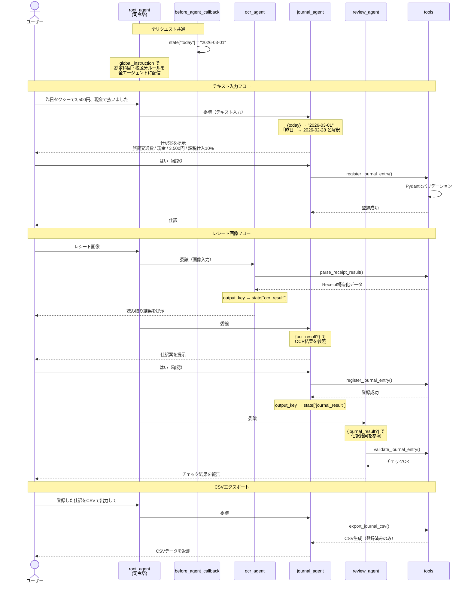

```mermaid
sequenceDiagram
    actor User as ユーザー
    participant Root as root_agent<br/>(司令塔)
    participant CB as before_agent_callback
    participant OCR as ocr_agent
    participant Journal as journal_agent
    participant Review as review_agent
    participant Tools as tools

    Note over Root,CB: 全リクエスト共通
    CB->>CB: state["today"] = "2026-03-01"
    Note over Root: global_instruction で<br/>勘定科目・税区分ルールを<br/>全エージェントに配信

    Note over User,Tools: テキスト入力フロー
    User->>Root: 昨日タクシーで3,500円、現金で払いました
    Root->>Journal: 委譲（テキスト入力）
    Note over Journal: {today} → "2026-03-01"<br/>「昨日」→ 2026-02-28 と解釈
    Journal-->>User: 仕訳案を提示<br/>旅費交通費 / 現金 / 3,500円 / 課税仕入10%
    User->>Journal: はい（確認）
    Journal->>Tools: register_journal_entry()
    Tools->>Tools: Pydanticバリデーション
    Tools-->>Journal: 登録成功 #1
    Journal-->>User: 仕訳 #1 を登録しました

    Note over User,Tools: レシート画像フロー
    User->>Root: レシート画像
    Root->>OCR: 委譲（画像入力）
    OCR->>Tools: parse_receipt_result()
    Tools-->>OCR: Receipt構造化データ
    Note over OCR: output_key → state["ocr_result"]
    OCR-->>User: 読み取り結果を提示
    Root->>Journal: 委譲
    Note over Journal: {ocr_result?} で<br/>OCR結果を参照
    Journal-->>User: 仕訳案を提示
    User->>Journal: はい（確認）
    Journal->>Tools: register_journal_entry()
    Tools-->>Journal: 登録成功
    Note over Journal: output_key → state["journal_result"]
    Root->>Review: 委譲
    Note over Review: {journal_result?} で<br/>仕訳結果を参照
    Review->>Tools: validate_journal_entry()
    Tools-->>Review: チェックOK
    Review-->>User: チェック結果を報告

    Note over User,Tools: CSVエクスポート
    User->>Root: 登録した仕訳をCSVで出力して
    Root->>Journal: 委譲
    Journal->>Tools: export_journal_csv()
    Tools-->>Journal: CSV生成（登録済みのみ）
    Journal-->>User: CSVデータを返却
```